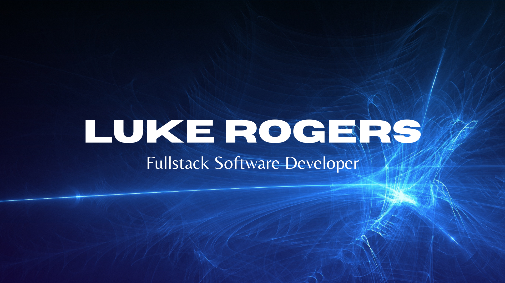

### Welcome! 👋

   

   

## My Journey: Becoming a Developer

My journey in the tech world has been an exhilarating blend of creativity and problem-solving. As a software developer, my true passion lies in crafting innovative solutions to tackle complex challenges head-on.

Before embarking on this path, I graduated from Wheaton College, a prestigious school, with a bachelors in business. Not long after, I had the privilege of serving as a project manager at a small software development and web design company. There, I collaborated closely with a talented team of designers and developers to bring to life a remarkable web application for none other than British Petroleum. The experience was both gratifying and enlightening, as I witnessed the power of technology in assisting businesses and consumer experience.

However, a pivotal moment came when I realized that I craved something more profound from my career. I observed the developers on my team and how they created amazing tools from scratch. This sparked the desire to make a tangible impact, to aid those in need, and to take on intricate problems headfirst. This desire ultimately fueled my decision to transition into a dedicated software development professional.

By delving into this dynamic field, I knew I could harness my creativity and problem-solving acumen to build tools that genuinely assist people and address challenging issues. The thought of contributing my skills to make the world a better place through software development filled me with unwavering determination.

As I continue to grow in my software development journey, I eagerly anticipate the countless opportunities to make a difference and positively impact the lives of others.

## Technologies and Tools

* **Languages**: JavaScript(ES6), HTML5, CSS3, Markdown
* **Libraries/Tools**: React, Git, npm, Node.js, Chart.js
* **Frameworks/Layouts**: Express.js, CSS Flexbox & Grid
* **Editor**: Visual Studio Code
* **OS**: macOS Ventura

## Most Used Languages

## Professional Competencies

* **Growth Mindset**
  * Highly adaptable, willing to start from scratch when approaches or tasks change
  * Enthusiastic learner with a strong curiosity about diverse subjects and processes
  * Driven by a passion for conducting thorough research to identify effective problem-solving solutions
  * Committed to continuous self-improvement in all aspects of life for personal growth and well-being
  * Embraces an inclusive work style, excels in collaborative team environments fostering open idea-sharing
  * Welcomes feedback as a crucial part of constant improvement, actively implements feedback for personal growth
* **Leadership**
  * Assumes responsibility for actions, avoids attributing blame to others when faced with challenges or mistakes
  * Committed to upholding integrity and ethical conduct, prioritizing doing the right thing even when unobserved
  * Passionate about mentoring and guiding others, providing encouragement and motivation throughout their journeys
  * Continuously developing self-confidence and credibility through personal growth efforts
* **Communication**
  * Demonstrates strong reading comprehension skills and efficiently absorbs information
  * Possesses excellent writing skills, creating clear and easily understandable content
  * Exhibits exceptional listening skills with unwavering focus and attention
  * Proficient speaker adept at conveying ideas effectively through speech
  * Highly responsive to messages, never ignores communication, and promptly follows up whenever possible

 ## Motivation to Work in Tech

 In the exhilarating world of the tech industry, my motivation knows no bounds! The prospect of creating cutting-edge software and transformative tools that aid those in need ignites a fire within me. I yearn to unleash my creativity and problem-solving prowess to craft ingenious solutions to the most intricate challenges.

To witness users being captivated by the interfaces and products I design, leaving them in awe, is a driving force behind my every endeavor. The satisfaction of making their lives easier through seamless experiences is my ultimate goal.

I am also energized by the endless possibilities that emerge from the skillful hands of a developer wielding code. The boundless potential to craft transformative solutions and shape the digital landscape fuels my passion for the tech industry even further.

As I embark on this journey, I am fueled by the vision of imparting my knowledge to the next generation of developers, nurturing a community of innovative minds. Together, we'll forge a path towards a brighter, technologically empowered future.

## Projects I am Currently Working on

* [My Portfolio](https://github.com/dlukerogers/portfolio)
* [City Explorer](https://github.com/dlukerogers/city-explorer)
* [City Explorer API](https://github.com/dlukerogers/city-explorer-api)

## What I am Currently Learning About

* React
* APIs
* String methods in JS
* Building servers

## Fun Facts

* I love watching and following sports 🏈🏀⚽🏒
* I played offensive line for the Wheaton College football team 🏈
* I like to mess around on the guitar 🎵
* I enjoy card games and have recently gotten into Monopoly Deal 🃏
* I am passionate about cooking and continue to discover delicious new meals and recipes 😋

## Resources Used to Build this Amazing Repo

* [Code Fellows Partner Power Hour: Oops! I Did Git Again by Hexx King](https://www.youtube.com/watch?v=p2rffnhw9Ec)
* [Canva](canva.com)
* [Font Awesome](https://fontawesome.com/)
* [Anura Ghazra github-readme-stats](https://github.com/anuraghazra/github-readme-stats)
* [Emoji Finder](https://emojifinder.com/)

